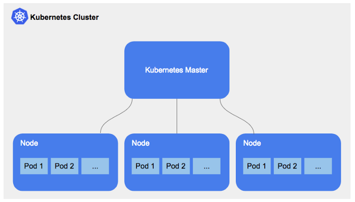

# What is Kubernetes?

- Kubernetes (also known as k8s or "kube") is an open source container orchestration platform that automates many of the manual processes involved in deploying, managing, and scaling containerized applications.
- Kubernetes was originally developed and designed by engineers at Google. Google was one of the early contributors to Linux container technology
- Google generates more than 2 billion container deployments a week, all powered by its internal platform, Borg. Borg was the predecessor to Kubernetes, and the lessons learned from developing Borg over the years became the primary influence behind much of Kubernetes technology.
## Benefits of k8

- Orchestrate containers across multiple hosts.
- Make better use of hardware to maximize resources needed to run your enterprise apps.
- Control and automate application deployments and updates.
- Mount and add storage to run stateful apps.
- Scale containerized applications and their resources on the fly.
- Declaratively manage services, which guarantees the deployed applications are always running the way you intended them to run.
- Health-check and self-heal your apps with autoplacement, autorestart, autoreplication, and autoscaling.
## Use case of K8

## Kubernetes Alternatives
- FaaS (Serverless) — Lambda, Google Functions, OpenFaaS, etc.
- PaaS — Heroku, Cloud Foundry, Google App Engine, etc.
- CaaS — Azure Container Instances, Google Cloud Run, Elastic Container Service, Fargate, DC/OS, etc.
- IaaS (VMs) — EC2, GCE, vSphere, etc.
- Bare Metal — MaaS, Packet, DIY, etc.
### Why not to use k8
- Kubernetes can be an overkill for simple applications. ...
- Kubernetes is very complex and can reduce productivity. ...
- The transition to Kubernetes can be cumbersome. ...
- Kubernetes can be more expensive than its alternatives.
### Managed services for K8
- Google Kubernetes Engine (GKE)
- Amazon Elastic Kubernetes Service (EKS)
- Microsoft Kubernetes Azure (AKS)
- IBM Cloud Kubernetes Service
- Oracle Container Engine for Kubernetes
- DigitalOcean Kubernetes

## Task
- First ensure all the require ports (80,3000,27017) are available this can be done by deleting the current containers running on the ports. (Push to dockerhub to ensure previous work is not lost)
- Create a k8 file called nginx_k8_deploy.yml
- Once created `kubectl creste -f filename.yml` will run the deployment file
- To check what is running use `kubectl get deploy`
- In order to display each replica run `kubectl get pods`
- To be aable to launch the deployment file to be displayed on the browser we need to create a `nginx_services.yml` file run it with `kubectl creste -f filename.yml`
- `kubectl edit deploy filename.yml` will open up a live editor in order to make live changes to the file
- In order to delete pods run `kubectl delete pod pod_id` (K8 will redeploy with self-healing)
- `kubectl edit svc nginx_k8_deploy` to open editing for the service
- `kubectl delete deploy filename` and `kubectl delete svc filename` are used to get rid of a service and its pods
