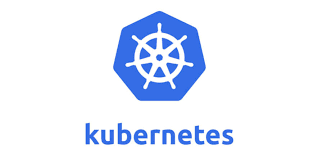
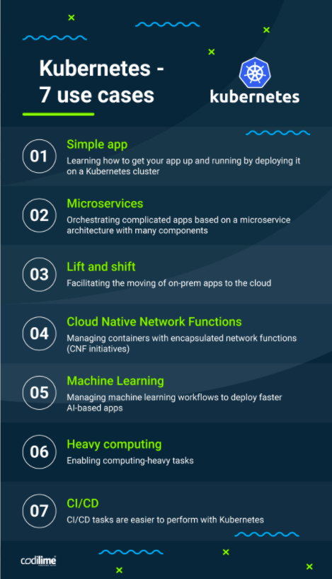

# What is Kubernetes?

- Kubernetes (also known as k8s or "kube") is an open source container orchestration platform that automates many of the manual processes involved in deploying, managing, and scaling containerized applications.
- Kubernetes was originally developed and designed by engineers at Google. Google was one of the early contributors to Linux container technology
- Google generates more than 2 billion container deployments a week, all powered by its internal platform, Borg. Borg was the predecessor to Kubernetes, and the lessons learned from developing Borg over the years became the primary influence behind much of Kubernetes technology.
## Benefits of k8
- Orchestrate containers across multiple hosts.
- Make better use of hardware to maximize resources needed to run your enterprise apps.
- Control and automate application deployments and updates.
- Mount and add storage to run stateful apps.
- Scale containerized applications and their resources on the fly.
- Declaratively manage services, which guarantees the deployed applications are always running the way you intended them to run.
- Health-check and self-heal your apps with autoplacement, autorestart, autoreplication, and autoscaling.

